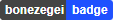

# bonezegei_badge
Simple badge for web using javascript

## Simple Text (URL Based)
  URL based uses url to directly display the image
#### Format 
URL+String

URL=https://img.bonezegei.com/text/?

String= param1 - param2
 * param1 = text (text space are define as _ . so if the text is more than 1 word instead of putting space between word sperate it by the character "_")
 * param2 = color of background 

| No | Sample | Description| URL Link|
|-----|-----|---|---|
|  1  |          | Sample 1    | https://img.bonezegei.com/text/?hello_world-tomato  |
|  2  |       | Sample 2    | https://img.bonezegei.com/text/?bonezegei_badge-teal  |


## JS Based
#### Samples
| No  | Sample Output                       | Badge type      | Height  | Width    |
|-----|-------------------------------------|-----------------|---------|----------|
|  1  |     |badgeSimpleText  | 20px    | Dynamic  |
|  2  |     |badgeDoubleText  | 20px    | Dynamic  |


## Simple Text
Displays basic text inside a box. The user must set first the img id for the image and call the javascipt function specifying the text, color and id of the desired badge.
badgeSimpleText(text, color, id);

#### Usage Example
```
  <html>
    <head>
      <script src="https://bonezegei.github.io/bonezegei-badge/src/bonezegei-badge.js"></script>
    </head>
    <body>
      
      <script>
        badgeSimpleText("bonezegei-badge", "green", "badge");
      </script>
    </body>
  </html>
```
#### Result

| No | Sample | Description| Demo Link|
|-----|-----|---|---|
|  1  | SimpleText      | Sample 1    | https://bonezegei.github.io/bonezegei-badge/sample/simpletext.html  |
|  2  | SimpleText      | Sample 2    | https://bonezegei.github.io/bonezegei-badge/sample/simpletext2.html |


## Double Text
badgeDoubleText(text1, text2, color1, color2, id);

#### Usage Example
```
<html>
  <head>
     <script src="https://bonezegei.github.io/bonezegei-badge/src/bonezegei-badge.js"></script>
  </head>
  <body style="display: block">
    <p>Simple Text</p>
    
    
    
    <br /><br />
    <p>Double Text</p>
    
    
    
    <script>
      badgeSimpleText("bonezegei-badge", "green", "badge");
      badgeSimpleText("version 1", "tomato", "badge2");
      badgeSimpleText("Bonezegei", "crimson", "badge3");

      badgeDoubleText("Version", "v1.0.1", "#333", "crimson", "badge4");
      badgeDoubleText("hello", "world", "green", "#333", "badge5");
      badgeDoubleText("bonezegei", "badge", "#444", "#1F51FF", "badge6");
    </script>
  </body>
</html>
```
#### Result

| No | Sample | Description| Demo Link|
|-----|-----|---|---|
|  1  | Double and Simple text      | Sample 1    | https://bonezegei.github.io/bonezegei-badge/sample/doubletext.html  |


